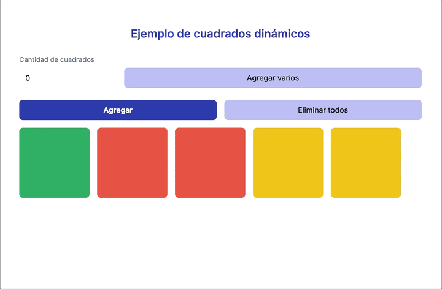
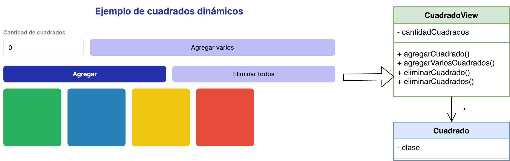

# ▪️ Cuadrados Pelela

[](https://github.com/uqbar-project/eg-cuadrados-pelela/actions/workflows/ci.yml)

## 🚀 Cómo ejecutarlo


Como de costumbre

```bash
nvm use
pnpm install
pnpm dev
```

1. **Ver la aplicación:**

Abrí tu navegador e ingresá a [http://localhost:5173](http://localhost:5173) para ver la aplicación funcionando en vivo.

## 🟦 De lado, a lado, cada uno en su cuadrado



En el ejemplo vemos que

- podemos crear una serie de cuadrados, indicando la cantidad
- también podemos eliminar todos los cuadrados existentes
- se puede agregar un cuadrado a la lista
- y al hacer click sobre el cuadrado se elimina
- cuando pasamos el mouse (hover) sobre un cuadrado se visualiza de un color "seleccionado" y también se muestra una animación para agrandarlo un poquito
- los cuadrados siguen el formato grid: se van ubicando de derecha a izquierda hasta ocupar el ancho y luego abajo

### Binding entre vista y view model



Si queremos crear 3 cuadrados:

- escribimos 3 en el input "cuadrados-input" que tiene un binding bidireccional con el view model, queda entonces **3** en el atributo cantidadCuadrados
- al presionar sobre el botón "Agregar varios" ejecutamos el método `agregarVariosCuadrados` del view model...
- ...que genera 3 cuadrados y los agrega a la lista `cuadrados` del view model...
- ...que a su vez hace redibujar el div cuya clase es "cuadrados-container". Se dispara un for-each y se muestran uno a uno los cuadrados...
- cada cuadrado tiene como clases: 1. cuadrado, 2. un binding con la propiedad `clase` del objeto cuadrado en cuestión


Algo similar pasa cuando se hace click en agregar un cuadrado.

Al eliminar un cuadrado:

- hacemos click sobre un elemento. Cada button tiene un evento click `eliminarCuadrado`
- pero como **participa dentro de un forEach** se le envía al método del view model un objeto que contiene el elemento del for-each, en este caso es el `cuadrado`...
- el viewModel lo puede recibir como parámetro y usar, para por ejemplo saber cuál es el cuadrado que debe eliminar


```ts
eliminarCuadrado({ cuadrado }: { cuadrado: Cuadrado }) {
  this.cuadrados = this.cuadrados.filter((cuadradoAEliminar) => cuadradoAEliminar !== cuadrado)
}
```

En general dentro de cualquier forEach cualquier evento de vista (como click) le pasa como parte del contexto el elemento que está recorriendo, o sea el `elemento of elementos`.
