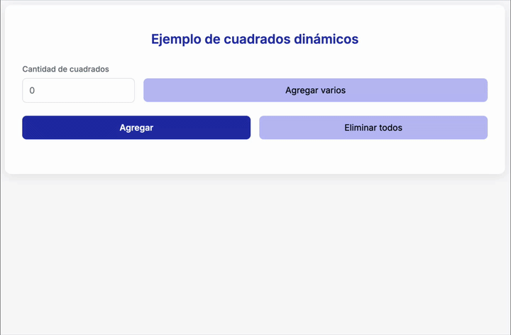

# 🔄 Conversor Pelela

[](https://github.com/uqbar-project/eg-cuadrados-pelela/actions/workflows/ci.yml)

## 🚀 Cómo ejecutarlo


Como de costumbre

```bash
nvm use
pnpm install
pnpm dev
```

1. **Ver la aplicación:**

Abrí tu navegador e ingresá a [http://localhost:5173](http://localhost:5173) para ver la aplicación funcionando en vivo.

## 🟦 De lado, a lado, cada uno en su cuadrado



